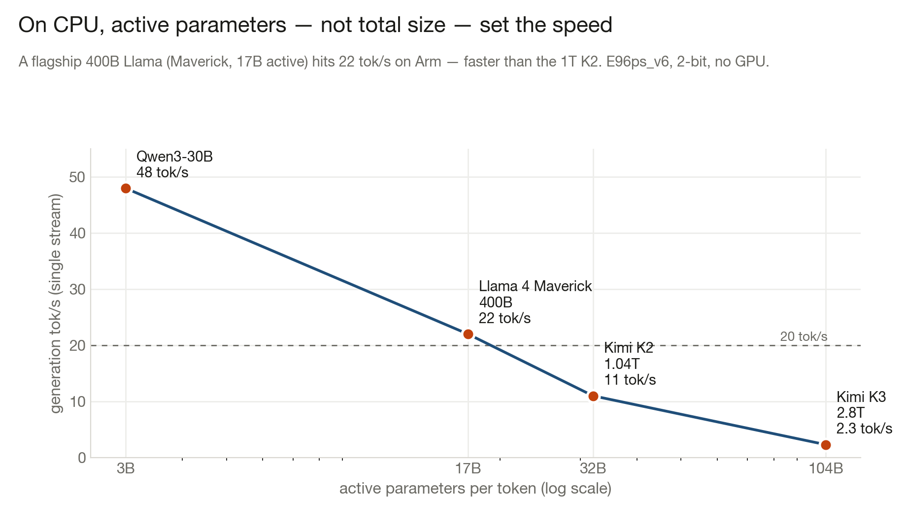

# NightShift — Llama & big-MoE on Arm CPUs

**Running flagship open models on Arm CPUs with no GPU — and researching how to make a
2.8-trillion-parameter model *run like a 1-trillion one*.**

Sister project to [NightShift (Kimi K2/K3 on Arm)](https://github.com/fidel-makatia/NightShift-a-trillion-parameter-AI-engineer-on-Arm-CPUs).
This repo is the Llama + compression/acceleration research track.

## Result so far: a flagship 400B Llama runs at 22 tok/s on an Arm CPU

**Llama 4 Maverick** (400B total, mixture-of-experts, **17B active/token**) on one Azure
`E96ps_v6` (96× Arm Neoverse-N2, Cobalt 100), 2-bit `UD-Q2_K_XL`, llama.cpp, **no GPU**:

| Threads | Prompt processing | Token generation |
|---|---|---|
| 48 | 69.8 tok/s | 21.8 tok/s |
| **64** | 92.8 tok/s | **22.0 tok/s** |
| 96 | 133.3 tok/s | 17.2 tok/s (NUMA cliff) |



**The finding:** on CPU, *active* parameters — not total size — set the speed. Maverick's 17B
active makes it **faster than the 1-trillion Kimi K2** (32B active, ~11 tok/s) and it clears the
20 tok/s interactive line. Raw benchmark: [`bench/maverick_bench.md`](bench/maverick_bench.md).

## The research goal: run a 2.8T like a 1T (or a 1T like a 500B)

CPU generation is memory-bandwidth-bound: $\text{TPS} \approx \dfrac{\text{BW}\times g}{B_{\text{tok}}}$,
with $B_{\text{tok}}$ = bytes read per token and $g$ = tokens accepted per forward pass. Making a
2.8T decode like a 1T means cutting $B_{\text{tok}}$ ~3× or raising $g$ ~3×. No single trick does
it — it's a stack:

1. **Speculative / MTP decoding** — raises $g$ with **zero accuracy loss** (verified). Expected
   accepted length is a geometric series $\frac{1-\alpha^{\gamma+1}}{1-\alpha}$, where acceptance
   $\alpha = 1 - D_{\mathrm{TV}}(p_{\text{target}}, q_{\text{draft}})$. **Key insight:** on a
   bandwidth-bound CPU the verify of $\gamma{+}1$ tokens is nearly free (weights read once), so the
   full geometric speedup lands — speculation is a *better* fit for CPU than GPU.
2. **[FGEQ](fgeq/FGEQ.md)** — Frequency-Graded Expert Quantization: allocate bits by measured
   routing frequency → less RAM at equal precision, or more precision at equal RAM.
   ([`fgeq/fgeq_sim.py`](fgeq/fgeq_sim.py) — feasibility simulation on real routing data.)
3. **Workload expert pruning** — drop experts that never fire on the target workload → smaller
   footprint, preserved on-workload accuracy.

## Try it

```bash
# FGEQ feasibility simulation (no deps beyond python3):
cd fgeq && python3 fgeq_sim.py

# Maverick benchmark (on an Arm box with llama.cpp built):
bash bench/bench_maverick.sh
```

## Status
Maverick benchmark: **measured**. FGEQ: **design + simulation** (not a shipped codec).
Speculative/MTP decoding: **in progress** — prototyping the acceptance rate $\alpha$ and real
speedup on a trillion-parameter model.
