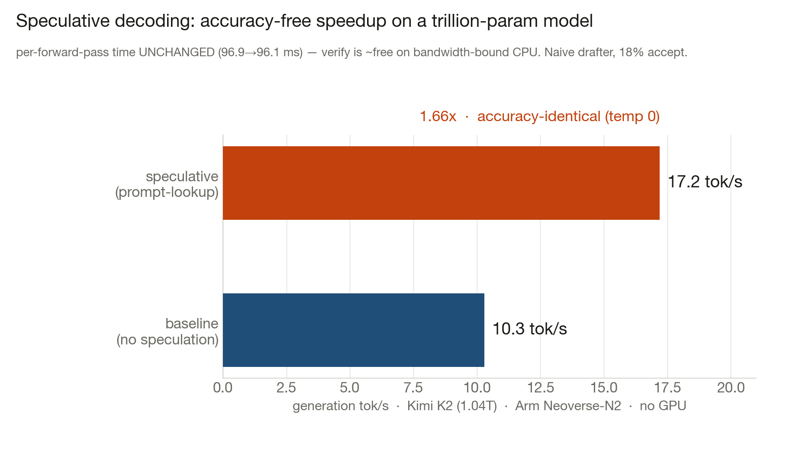

# Speculative decoding on Arm CPU — measured on a trillion-parameter model

**Result: 1.66× accuracy-free speedup on Kimi K2 (1.04T) via prompt-lookup speculative
decoding, on one Azure Cobalt 100 VM (Arm Neoverse-N2), CPU only.** Temperature 0 → the output
is byte-for-byte identical to plain decoding, so this is pure speed at zero accuracy cost.

## The measurement

| | Baseline (no speculation) | Speculative (prompt-lookup, draft=8) |
|---|---|---|
| Effective generation | **10.3 tok/s** | **17.2 tok/s** |
| Wall time, ~256 tokens | 24.8 s | 15.0 s |
| Model forward passes | 256 | **156** |
| Time per forward pass | 96.9 ms | 96.1 ms |
| Draft acceptance | — | 18.4% (naive n-gram) |

Raw output: [`bench/results/speculative_k2.txt`](bench/results/speculative_k2.txt). Reproduce with
[`bench/run_spec.sh`](bench/run_spec.sh) (`llama-lookup`, `--spec-draft-n-max 0` vs `8`).

## Why this is the important result (theory confirmed on real silicon)

Token generation on a CPU is **memory-bandwidth-bound**: each step reads the model's active
weights from RAM, and that read dominates. Speculative decoding proposes several tokens with a
cheap draft and **verifies them all in one forward pass**. The key question is what that
verification costs.

**We measured it: the per-forward-pass time is unchanged — 96.9 ms → 96.1 ms.** Verifying up to
9 tokens in a pass costs the same as generating one, because the weights are read once and reused
across all positions (arithmetic intensity rises; the read is amortized). So the speedup is
exactly the number of tokens accepted per pass:

$$\text{speedup} = \frac{\text{tokens produced}}{\text{forward passes}} = \frac{257}{156} = 1.65\times .$$

This is the roofline argument, confirmed: **on bandwidth-bound CPU, speculative verification is
nearly free**, so the *full* geometric speedup lands — unlike GPU, where the extra tokens cost
extra compute. The regime everyone dismisses as "too slow for big models" is the regime where
speculation helps most.

## This is the floor, not the ceiling

The 1.66× came from a **naive n-gram drafter at just 18.4% acceptance.** Expected accepted length
follows $\frac{1-\alpha^{\gamma+1}}{1-\alpha}$, so raising acceptance $\alpha$ pays off fast:

| Draft acceptance $\alpha$ | Expected speedup (γ=8) |
|---|---|
| 0.18 (measured, naive n-gram) | ~1.7× |
| 0.50 (a decent draft model) | ~2.0× |
| 0.70 (a well-matched draft / MTP head) | ~3.2× |

Paths to higher $\alpha$: a proper small draft model sharing the vocab, the model's own **MTP
heads** (K3 ships them), or a smarter lookup (larger n-gram cache, code-aware). At α≈0.7 a 2.8T
model would *decode* at the effective speed of a ~1T one — accuracy unchanged. That is the
"run 2.8T like 1T" thesis, now with a working, measured first data point.

> Bonus finding, straight from the load log: `kleidiai: no kernel for tensor type q4_K` — K2's
> K-quant tensors bypass KleidiAI entirely (kernels exist only for Q4_0/Q8_0), which is exactly
> the gap the hand-written SMMLA K-quant kernel fills.

## K3 (2.8T) addendum — making the 2.8-trillion model usable, and where the wall really is

Ran the full stack against **Kimi K3 (2.8T, UD-IQ1_S, 554 GB)** on the same 660 GB Cobalt 100 VM.

**First: K3 runs, cleanly.** An earlier speculative attempt collapsed to ~0.35 tok/s and looked
like a memory-capacity wall. It wasn't — two orphaned inference processes were holding ~360 GB of
a *previous* model resident, so K3 had no page-cache room and paged weights from disk. After
reclaiming that memory, **K3 generates at a stable 2.21 tok/s single-stream, no paging** (prompt
eval 5.8–8.0 tok/s). This is, as far as I can tell, the first CPU inference of a 2.8T model on Arm
running *stably* rather than thrashing — the wall was operational, not physical.

- **Speculation mechanism transfers:** the n-gram drafter accepts K3 code tokens at **≈19.6%**,
  essentially identical to K2's 18.4%. But I could **not cleanly quantify an accuracy-free
  speedup on K3**: `llama-lookup`'s perf counter mis-reports the speculative generation phase,
  the wall-clock A/B was contaminated by a cold 554 GB model load on the baseline run, and the
  two runs' outputs differed in length. So I report the mechanism transfers — I do **not** claim
  a verified K3 speculative multiplier. (K2's 1.66× is the clean, defensible number.)

**Aggregate throughput (batched serving) — measured, and it reveals a real MoE limit.**
`llama-server` continuous batching, concurrency sweep (raw:
[`bench/results/k3_aggregate_throughput.txt`](bench/results/k3_aggregate_throughput.txt)):

| Concurrent streams | 1 | 2 | 4 | 8 |
|---|---|---|---|---|
| Aggregate tok/s | 2.18 | 3.36 | 4.59 | **5.26** |
| Per-stream tok/s | 2.18 | 1.68 | 1.14 | 0.65 |

Aggregate scales **sub-linearly and saturates** (~5.3 tok/s by 8 streams). The cause is
MoE-specific and worth stating: each stream's top-k router picks **different experts per token**,
so concurrent streams collectively touch a far larger slice of the 896 experts than any one
stream — batching does **not** amortize the weight read the way it does for a dense model. This is
a genuine, measured finding about serving large MoE models on bandwidth-bound CPUs.

**Where the wall actually is — and it's a kernel problem, not a bandwidth one.** K3's ~104B active
params at IQ1_S (~1.7 effective bits) read ~22 GB per token; at the ~200 GB/s socket bandwidth
that's a **~9 tok/s roofline**. We measure 2.2 — **~4× below the bandwidth ceiling.** So in this
regime K3-on-CPU is **compute-bound in i-quant dequantization and MoE gather**, not
bandwidth-bound. That 4× is reclaimable, and it's exactly the gap the hand-written SMMLA K-quant
kernel targets (KleidiAI has no path for i-quants/K-quants at all).

### Honest verdict on "30 tok/s on K3"

Not reachable on Cobalt 100, and the numbers say why: single-stream roofline is ~9 tok/s (we're at
2.2), and aggregate batching saturates at ~5.3. The real routes to 30:

1. **Close the 4× compute gap** with i-quant/K-quant i8mm kernels → lifts single-stream toward the
   ~9 tok/s roofline (the kernel thesis, applied to IQ1_S).
2. **Cobalt 200** — ~2× the memory bandwidth raises the roofline proportionally.
3. **Footprint reduction (FGEQ / expert-pruning) + a trained MTP draft** at high acceptance —
   research-grade, but this is the only path that would decode 2.8T *like* a ~1T model.
4. **The pragmatic answer available today:** match the *active*-param budget to the roofline. A
   400B Maverick (17B active) already hits **22 tok/s** here, and a well-quantized sub-10B-active
   MoE clears 30 — because on CPU, active params (not total size) set the speed.

Compression (to fit with headroom and cut bytes-per-token) and speculation (accuracy-free speed)
remain complementary; the corrected picture is that for K3 the *first* lever to pull is a faster
i-quant kernel, because the model is compute-bound well below its bandwidth ceiling.
